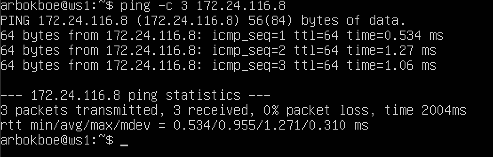
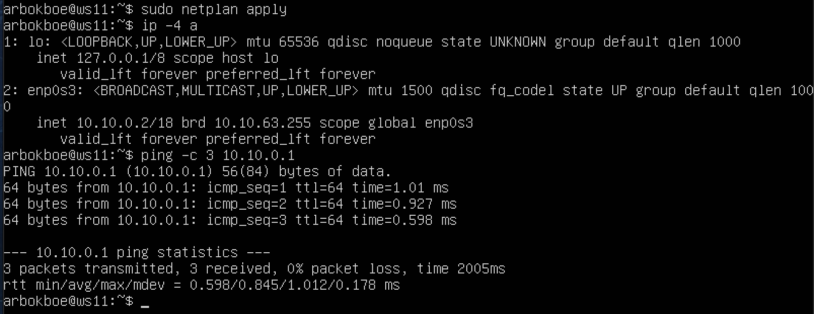
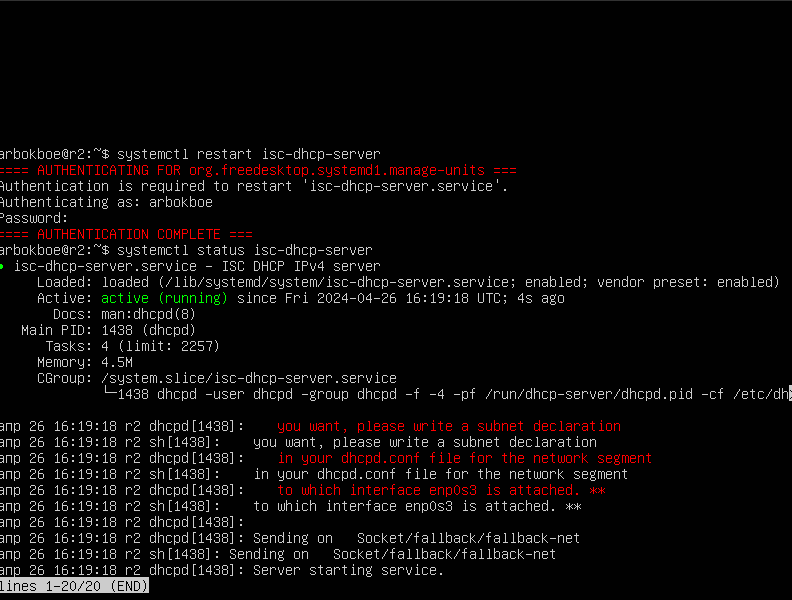
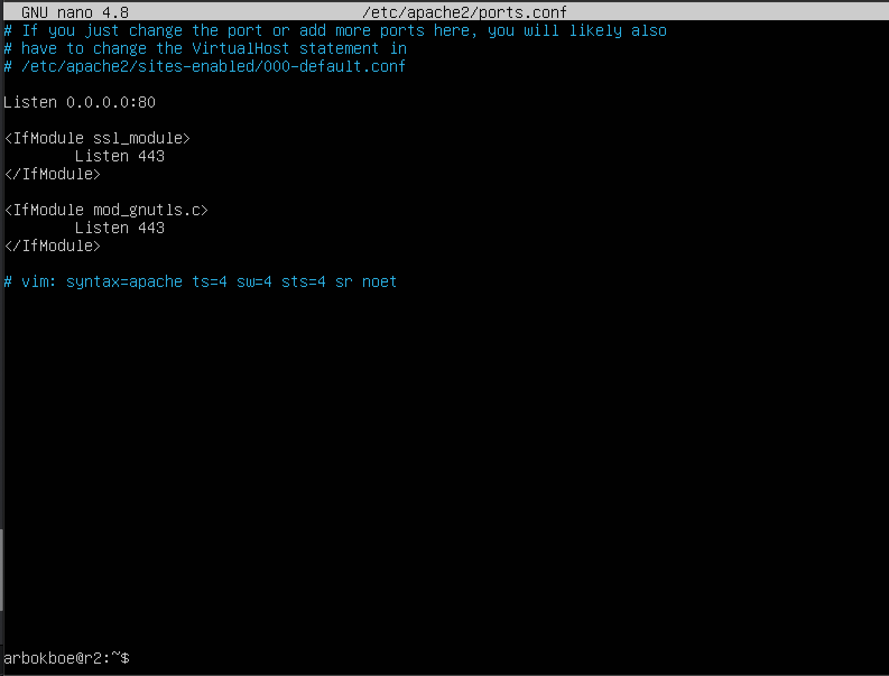

## Part 1. Инструмент ipcalc

### Адрес сети 192.167.38.54/13

### Перевод маски 255.255.255.0 в префиксную и двоичную запись, /15 в обычную и двоичную, 11111111.11111111.11111111.11110000 в обычную и префиксную

 ### 255.255.255.0 в префиксной: /24 
 ### 255.255.255.0 в двоичной: 11111111.11111111.11111111.00000000

    
### /15 в обычной: 255.254.0.0
### /15 в двоичной: 11111111.11111110.00000000.00000000

    
### 11111111.11111111.11111111.11110000 в обычной: 255.255.255.240
### 11111111.11111111.11111111.11110000 в префиксной: /28 
    

    
### Минимальный и максимальный хост в сети 12.167.38.4 при масках: /8,       
### 11111111.11111111.00000000.00000000, 255.255.254.0 и /4

На скрине минимальные и максимальные хосты по заданным маскам 

    
1.2. localhost
 
### 194.34.23.100 - нет
### 127.0.0.2 - да
### 127.1.0.1 - да
### 128.0.0.1 - нет

1.3. Диапазоны и сегменты сетей

Какие из перечисленных IP можно использовать в качестве публичного, а какие только в качестве частных:

### 10.0.0.45 - частный
### 134.43.0.2 - публичный
### 192.168.4.2 - частный
### 172.20.250.4 - частный
### 172.0.2.1 - публичный
### 192.172.0.1 - публичный
### 172.68.0.2 - публичный
### 172.16.255.255 - частный
### 10.10.10.10 - частный
### 192.169.168.1 - публичный

Какие из перечисленных IP адресов шлюза возможны у сети 10.10.0.0/18:

### 10.0.0.1 - возможен
### 10.10.0.2 - возможен
### 10.10.10.10 - возможен
### 10.10.100.1 - невозможен
### 10.10.1.255 - невозможен

## Part 2. Статическая маршрутизация между двумя машинами

ip a (ws1, ws2)

Описан сетевой интерфейс, соответствующий внутренней сети, на обеих машинах и заданы следующие адреса и маски: ws1 - 192.168.100.10, маска /16, ws2 - 172.24.116.8, маска /12

netplan apply

2.1. Добавление статического маршрута вручную

 Команды для добаления статического маршрута

пинг

2.2. Добавление статического маршрута с сохранением

Изменённые файлы etc/netplan/00-installer-config.yaml

еще раз пропинговал 

## Part 3. Утилита iperf3

3.1. Скорость соединения

### 8 Mbps = 1 MB/s
### 100 MB/s = 819200 Kbps
### 1 Gbps = 1024 Mbps

3.2. Утилита iperf3

Скорость соединения между ws1 и ws2

## Part 4. Сетевой экран

4.1. Утилита iptables

Нужно добавить в файл подряд следующие правила:
1) на ws1 применить стратегию когда в начале пишется запрещающее правило, а в конце пишется разрешающее правило (это касается пунктов 4 и 5)
2) на ws2 применить стратегию когда в начале пишется разрешающее правило, а в конце пишется запрещающее правило (это касается пунктов 4 и 5)
3) открыть на машинах доступ для порта 22 (ssh) и порта 80 (http)
4) запретить echo reply (машина не должна "пинговаться”, т.е. должна быть блокировка на OUTPUT)
5) разрешить echo reply (машина должна "пинговаться")

Запустить файлы на обеих машинах командами chmod +x /etc/firewall.sh и /etc/firewall.sh

4.2. Утилита nmap

Пингую ws1

Пингую ws2 и вызываю команду nmap

## Part 5. Статическая маршрутизация сети

5.1. Настройка адресов машин

Настроил конфигурации машин в etc/netplan/00-installer-config.yaml согласно сети на рисунке

   
   ip -4 a, a так же пропинговал ws21 к ws22
   
   
   
   ip -4 a, a так же пропинговал ws1 к r1
   
   
   
  5.2. Включение переадресации IP-адресов.

    sysctl -w net.ipv4.ip_forward=1
    

Открыл файл /etc/sysctl.conf и добавил в него следующую строку: net.ipv4.ip_forward = 1

5.3. Установка маршрута по-умолчанию

etc/netplan/00-installer-config.yaml

ws11 ws21 ws 22

r1 и r2

ip r

tcpdump -tn -i enp0s9(r2) и ping -c 5 10.100.0.12(ws11)

5.4. Добавление статических маршрутов

netplan роутеров:

ip r r1 и r2

ip r list 10.10.0.0/(маска сети) и ip r list 0.0.0.0/0

Для адреса 10.10.0.0/18 был выбран маршрут, отличный от 0.0.0.0/0, потому что при наличии нескольких маршрутов одинаковой длины выбирается тот маршрут, который задан наиболее точно.

5.5. Построение списка маршрутизаторов

Вывод команд traceroute и tcpdump

### Утилита Traceroute вместо ICMP-запроса отправляет 3 UDP-пакета на определенный порт целевого хоста и ожидает ответа о недоступности этого порта. Первый пакет отправляется с TTL=1, второй с TTL=2 и так далее, пока запрос не попадёт адресату. Так как вместо ICMP-запроса он отправляет UDP-запрос, в каждом запросе есть порт отправителя и порт получателя. По умолчанию запрос отправляется на закрытый порт 34434. Когда запрос попадёт на хост назначения, этот хост отправит ответ о недоступности порта «Destination port unreachable» (порт назначения недоступен). Это значит, что адресат получил запрос. Traceroute воспримет этот ответ как завершение трассировки.

 5.6. Использование протокола ICMP при маршрутизации

Пинг несуществующего ip, дамп с r1

## Part 6. Динамическая настройка IP с помощью DHCP

Для r2 настройте службу DHCP в файле /etc/dhcp/dhcpd.conf:

укажите адрес роутера по умолчанию, DNS-сервер и адрес внутренней сети. Вот пример файла для r2:

виртуальная машина r2

sudo vim /etc/dhcp/dhcpd.conf

напишите сервер имен 8.8.8.8. в файле resolv.conf

виртуальная машина r2

sudo vim /etc/resolv.conf

Перезапустите службу DHCP с помощью systemctl restart isc-dhcp-server.

виртуальная машина r2

systemctl restart isc-dhcp-server

Машину ws21 перезагрузи при помощи reboot и через ip a покажи, что она получила адрес. Также пропингуй ws22 с ws21.

Также пропингуй ws22 с ws21.

Укажите MAC-адрес в ws11, добавив в файл etc/netplan/00-installer-config.yaml:

sudo vim /etc/netplan/00-installer-config.yaml
sudo netplan apply

Настройте r1 так же, как и r2, но назначение адресов сделайте строго привязанным к MAC-адресу (ws11). Проведите те же тесты

пинг с ws22 ws11

Запросить обновление IP-адреса от ws21

ip a

sudo dhclient -v

## Part 7. NAT

В файле /etc/apache2/ports.conf измените строку Listen 80 на Listen 0.0.0.0:80 на ws22 и r1, т.е. сделайте сервер Apache2 общедоступным.

виртуальная машина ws22

sudo vim /etc/apache2/ports.conf

виртуальная машина r2

sudo vim /etc/apache2/ports.conf

Запустите веб-сервер Apache с помощью команды запуска службы apache2 на ws22 и r1.

виртуальная машина ws22

sudo service apache2 start

виртуальная машина r2

sudo service apache2 start

Добавьте следующие правила в межсетевой экран, созданный аналогично межсетевому экрану из части 4, на r2:

1) удалить правила в таблице фильтров - iptables -F

2) удалить правила в таблице "NAT" - iptables -F -t nat

3) отбросить все маршрутизируемые пакеты — iptables --policy FORWARD DROP

виртуальная машина r2

sudo vim /etc/firewall.sh

Далее запустите созданный файл командой sudo /etc/firewall.sh и затем проверьте соединение между ws22 и r1 командой ping 10.20.0.20 на r1

виртуальная машина r2

sudo chmod +x /etc/firewall.sh
sudo sh /etc/firewall.sh

виртуальная машина ws22

ping 10.10.0.1

Согласно этим правилам, пинг не удался, поскольку все маршрутизированные пакеты отбрасываются.

Добавьте в файл еще одно правило:

4) разрешить маршрутизацию всех пакетов протокола ICMP

виртуальная машина r2

iptables -A FORWARD -p icmp -j ACCEPT

Проверьте соединение между ws22 и r1 с помощью команды ping.

виртуальная машина r1

ping 10.20.0.20 -c 3

Добавьте в файл еще два правила:

5) включите SNAT, который маскирует все локальные IP-адреса из локальной сети за r2 (как определено в части 5 — сеть 10.20.0.0)

6) включите DNAT на порту 8080 компьютера r2 и добавьте внешний сетевой доступ к веб-серверу Apache, работающему на ws22.

Команда iptables -t nat -A POSTROUTING -o enp0s9 -s 10.20.0.0/26 -j SNAT --to-source 10.100.0.12делает следующее:

-t nat: указывает iptablesна использование таблицы NAT.
-A POSTROUTING: добавляет правило в цепочку POSTROUTING таблицы NAT . Цепочка POSTROUTING применяет правила к пакетам после их маршрутизации.
-o enp0s9: указывает выходной интерфейс, через который пакеты будут отправляться во внешнюю сеть. В данном случае используется интерфейс enp0s9 .
-s 10.20.0.0/26: указывает исходный IP-адрес пакетов, соответствующих этому правилу. В этом случае указан диапазон IP-адресов 10.20.0.0/26 , то есть все IP-адреса в сети 10.20.0.0/26 .
-j SNAT: указывает действие, которое необходимо предпринять, если пакет соответствует правилу. В этом случае используется SNAT (трансляция адресов исходной сети), что означает, что IP-адрес отправителя пакета будет заменен на тот, который указан в следующем параметре.
--to-source 10.100.0.12: указывает IP-адрес, на который будет заменен исходный IP-адрес пакета. В этом случае указанный IP-адрес — 10.100.0.12 . Это означает, что все пакеты, соответствующие этому правилу, будут иметь 10.100.0.12 в качестве IP-адреса источника при передаче во внешнюю сеть.
Команда iiptables -t nat -A PREROUTING -i enp0s9 -p tcp --dport 8080 -j DNAT --to-destination 10.20.0.20делает следующее:

-A PREROUTING добавляет в цепочку PREROUTING правило, которое обрабатывает пакеты перед их маршрутизацией.
-i enp0s9 определяет интерфейс enp0s9 как исходящий интерфейс, т. е. пакеты, проходящие через этот интерфейс, будут соответствовать этому правилу.
-p tcp указывает, что правило будет применяться только к TCP-пакетам.
--dport 8080 указывает, что правило будет применяться только к пакетам с адресом порта назначения 8080.
-j DNATозначает, что пакеты, соответствующие этому правилу, будут перенаправлены (Destination NAT) на другой адрес.
--to-destination 10.20.0.20:80 указывает адрес и порт, на который будут перенаправлены пакеты.
Проверьте TCP-соединение на предмет SNAT, подключившись с ws22 к серверу Apache на r1 с помощью команды telnet [адрес] [порт]

Проверьте TCP-соединение на наличие DNAT, подключившись с r1 к серверу Apache на ws22 командой telnet (адрес r2 и порт 8080)

## Part 8. Дополнительно. Знакомство с SSH Tunnels

Запустите фаервол на r2 по правилам из части 7.

Запустите веб-сервер Apache на ws22 только на локальном хосте — в файле /etc/apache2/ports.conf измените строку Listen 80 ** на**Listen localhost:80

Запустил сервер и проверил, что он запускается с ps -A | grep apache.

1) Используйте локальную переадресацию TCP с ws21 на ws22 для доступа к веб-серверу на ws22 из ws21.

Переадресация локального порта позволяет перенаправить порт на локальном компьютере (ssh-клиент) на порт на удаленном компьютере (ssh-сервер), который затем перенаправляется на порт на конечном компьютере. При этом типе перенаправления клиент SSH прослушивает указанный порт и туннелирует любое соединение с этим портом на указанный порт на удаленном сервере SSH, который затем подключается к порту на конечном компьютере. Конечным компьютером может быть удаленный SSH-сервер или любой другой компьютер.

Пробросим порт с сервера по следующему алгоритму:

На машине ws22: создайте соединение с машины ws22, на которой установлен ssh-сервер, к машине ws 21.
На машине ws22: используйте команду ssh -L, чтобы установить «прямое» соединение с машины ws21 на машину ws22.

ssh 10.20.0.20

Оставаясь на машине ws22, установите соединение с сервером ws22 с машины ws21.

ssh -L 8080:127.0.0.1 10.20.0.20
Проверка процессов на машине ws22 после создания соединения

ps aux | grep sshd

На машине ws21 запустите утилиту telnet.

telnet 127.0.0.1 8080

Проверьте запущенные процессы на машине ws22 и «убейте» процесс, отвечающи подключение к серверу когда процесс на машине ws21, ответственный за соединение, «убит», на машине ws22 появляется сообщение

ps aux | grep sshd
kill -9 1058

2) Используйте удаленную переадресацию TCP с ws11 на ws22 для доступа к веб-серверу на ws22 из ws11.

Переадресация удаленных портов является противоположностью переадресации локальных портов. При этом порт на удаленном компьютере (ssh-сервере) перенаправляется на порт на локальном компьютере (ssh-клиенте), который затем перенаправляется на порт на конечном компьютере. В этом типе перенаправления сервер SSH прослушивает указанный порт и туннелирует любое соединение на этом порту к указанному порту локального клиента SSH, который затем подключается к порту на конечном компьютере. Машина назначения может быть локальной или любой другой машиной. Удаленная переадресация портов в основном используется для того, чтобы позволить кому-то извне получить доступ к внутренней службе.

Из-за настроек брандмауэра на маршрутизаторе r2 невозможно подключиться к серверу Apache на компьютере ws22 с помощью ssh -L с компьютера ws11 (маршрутизатор r2 не разрешает эту команду). В этом случае вам нужно использовать команду ssh -R. Это необходимо сделать на машине ws22 в несколько шагов:

На машине ws11: На машине ws11: переключитесь с машины ws11 на маршрутизатор r2 с помощью ssh (маршрутизатор не позволит вам напрямую перейти к машине ws22);
На машине ws11: переключитесь с маршрутизатора r2 на машину ws22 с помощью ssh;
На машине ws11: туннелируйте от машины ws22 к машине ws11 с помощью ssh -R;
Описание команды:

ssh -R [remote_address:]remote_port:local_address:local_port [user@]
Запустите команду с машины ws11.

ssh 10.100.0.12
Эта команда показывает следующее изображение с машины ws11, которое изменит хост текущей машины на r2.

Затем, находясь физически на том же компьютере ws11 с именем хоста r2, введите следующую команду

ssh 10.20.0.20
Находясь на машине ws11, получаем следующий результат r2 -> ws22

В предыдущей статье на роутере r2 был настроен межсетевой экран, который не позволяет пропускать пакеты из другой сети. Итак, сначала вам нужно туннелировать с ws22 на ws11. Для этого выполните команду на машине ws11

ssh -R 10.10.0.2:8080:127.0.0.1:80 10.10.0.2

Чтобы проверить, сработало ли соединение, зайдите на второй терминал (для этого с терминала машины ws11 нажмите option + fn + F2 или Alt + F2) и отправьте команду (telnet 127.0.0.1 [локальный порт]) . В момент выполнения этой команды нужно нажать любую клавишу

telnet 127.0.0.1 8080

